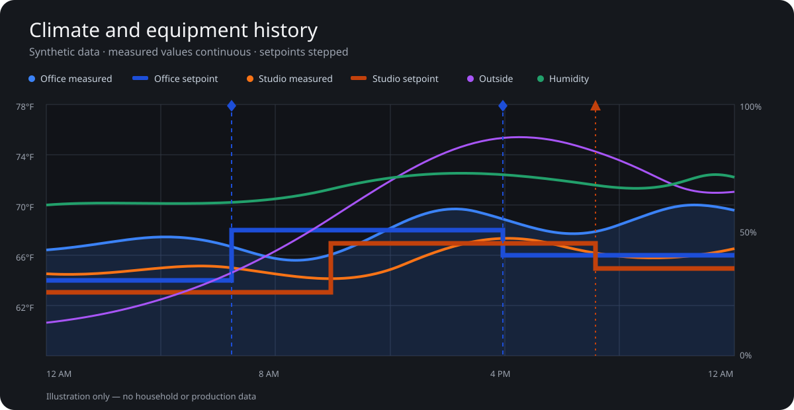

# Climate History Card

A provider-neutral Home Assistant card for understanding climate behavior over time. It keeps measured values continuous, renders commanded setpoints as steps, and shades equipment-active periods only beneath the measured-temperature curve for the corresponding zone.



The image and every entity in this repository are synthetic. The card reads only the Home Assistant entities you configure; it has no external network dependency, analytics, or telemetry.

## Why this card

Most history charts draw every signal with the same semantics. Climate data is different:

- Measured temperature is a sampled physical quantity, so it is shown as a continuous line.
- A setpoint is a held command, so it is shown as a stepped line.
- Equipment-active shading is clipped by both the active interval and that zone's measured-temperature path.
- A command-log marker is labelled **recorded** only when a configured entity contains a record.
- A setpoint change that cannot be paired with a record is labelled **unattributed**. The card does not guess whether a person, automation, integration, or device caused it.

## Installation

### HACS

1. Add this repository to HACS as a **Dashboard** custom repository until it is accepted into the default catalog.
2. Install **Climate History Card**.
3. Refresh the browser once after installation.

### Manual

Copy `dist/climate-history-card.js` to Home Assistant's `www` directory and add `/local/climate-history-card.js` as a JavaScript module resource.

## Minimal configuration

```yaml
type: custom:climate-history-card
title: Climate history
zones:
  - name: Office
    temperature: sensor.office_temperature
    setpoint: sensor.office_setpoint
    active: binary_sensor.office_hvac_active
```

## Complete example

```yaml
type: custom:climate-history-card
title: Climate and equipment history
subtitle: Measurements, setpoints, equipment activity and humidity
temperature_unit: °F
selected_date: true
refresh_seconds: 60
command_match_seconds: 125
show_unattributed_changes: true
zones:
  - name: Office
    temperature: sensor.office_temperature
    setpoint: sensor.office_setpoint
    active: binary_sensor.office_hvac_active
    command_log: input_text.office_last_climate_command
    color: "#3B82F6"
    setpoint_color: "#1D4ED8"
    active_color: "#3B82F6"
    active_states: [on, cooling, heating]
  - name: Studio
    temperature: sensor.studio_temperature
    setpoint: sensor.studio_setpoint
    active: binary_sensor.studio_hvac_active
    color: "#F97316"
    setpoint_color: "#C2410C"
outside:
  entity: weather.example_home
  attribute: temperature
  label: Outside
  color: "#A855F7"
  resample_minutes: 30
secondary:
  entity: sensor.indoor_humidity
  label: Humidity
  unit: "%"
  min: 0
  max: 100
  color: "#22A06B"
```

Place Home Assistant's built-in `energy-date-selection` card on the same dashboard to select a local calendar day. Set `selected_date: false` and use `hours_to_show` for a rolling interval instead. `today: true` selects local midnight through the next local midnight and leaves the future portion blank.

## Configuration

| Option | Required | Description |
| --- | --- | --- |
| `zones` | Yes | One or more zone objects. Each requires `temperature` and `setpoint`. |
| `zones[].name` | No | Display label. Defaults to `Zone N`. |
| `zones[].active` | No | Entity whose configured active states define shaded intervals. |
| `zones[].command_log` | No | Entity whose state contains JSON or text describing a recorded command. |
| `zones[].active_states` | No | Active values; defaults to `on`, `cooling`, `heating`, and `active`. |
| `zones[].color` | No | Measured-temperature color. |
| `zones[].setpoint_color` | No | Stepped-setpoint color. |
| `zones[].active_color` | No | Active shading color. |
| `outside` | No | Optional continuous temperature series. Set `attribute` for a weather entity. |
| `secondary` | No | Optional continuous right-axis series with configurable label, unit, min, max and color. |
| `selected_date` | No | Follow the dashboard energy-date collection; defaults to `true`. |
| `collection_key` | No | Advanced override for a custom Home Assistant collection key. |
| `today` | No | Use the current local calendar day when date selection is disabled. |
| `hours_to_show` | No | Rolling interval when both date options are disabled; defaults to 24 hours. |
| `temperature_unit` | No | Axis and tooltip unit; defaults to `°F`. This changes presentation only and does not convert values. |
| `temperature_min`, `temperature_max` | No | Fixed left-axis bounds. Omit for data-driven bounds. |
| `command_match_seconds` | No | Maximum delay when pairing a recorded command to the matching setpoint change. |
| `show_unattributed_changes` | No | Show unmatched setpoint changes; defaults to `true`. |

## Command-log state

The optional command-log entity may contain plain text or JSON. Recognized JSON target fields are `target_temperature`, `temperature`, `target`, and `setpoint`; recognized descriptive fields are `source`, `reason`, and `detail`.

```json
{"source":"schedule","target_temperature":72}
```

A matching target and timestamp window can associate this recorded command with a setpoint change. This is correlation, not proof of actor identity; the card preserves the configured record's wording and labels unmatched changes as unattributed.

## Development

Requires Node.js 20 or newer and no third-party runtime dependencies.

```bash
npm run validate
```

This builds the HACS artifact, checks both source and distribution syntax, runs synthetic behavioral tests, and scans publishable files for private identifiers and credential-like values.

## Release checklist

1. Update the version and changelog.
2. Run `npm run validate`.
3. Commit the generated `dist/climate-history-card.js`.
4. Create a GitHub release whose tag matches the version and attach `dist/climate-history-card.js` as `climate-history-card.js`.
5. Run the HACS validation workflow before requesting default-catalog inclusion.

## License

Apache License 2.0.
